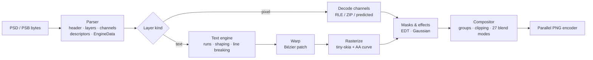

<div align="center">


# PSD Compiler

**Turn Photoshop files into pixel-perfect PNGs on any machine, with no Photoshop, no browser and no GPU.**

`psdc` parses PSD/PSB files and composites every layer. It also **re-renders text layers from the type data**, so text you edit in the file shows up in the output.

[](https://github.com/ChoqueCastroLD/psd-compiler-cli/actions/workflows/ci.yml)
[](LICENSE)
[](https://www.rust-lang.org)


[Quick start](#quick-start) ·
[CLI](docs/CLI.md) ·
[Library](#use-it-as-a-library) ·
[How it works](docs/ARCHITECTURE.md) ·
[Text engine](docs/TEXT_ENGINE.md) ·
[FAQ](#faq)

</div>

---

## Why

Most tools that "render" a PSD actually show you the **merged preview** Photoshop saved in the file, or the **cached pixels** of each layer. Once you change a text layer (translate a comic, fill a template, localize a banner), those pixels are stale. Your only option left is to open Photoshop.

PSD Compiler reads the type engine data (characters, style runs, paragraphs, warps and effects) and lays the text out again with the real fonts. It was calibrated against Photoshop until the output matched.

```text
                   ┌──────────────┐
  page.psd  ─────▶ │     psdc     │ ─────▶  page.png
  (edited text)    │  parse       │         (text re-rendered,
                   │  shape       │          effects applied,
  fonts/    ─────▶ │  rasterize   │          layers composited)
                   │  composite   │
                   └──────────────┘
```

## Highlights

- 🎯 **Photoshop-grade text.** Kerning, tracking, leading, paragraph boxes, justification, faux bold and italic, all caps and small caps, baseline shift, underline and strikethrough. Text layers on real comic pages reach **IoU ≈ 0.97** against Photoshop's own rasters.
- 🌀 **All 15 warp presets.** Arc, Arch, Bulge, Flag, Wave, Fish, Rise, Fisheye, Inflate, Squeeze, Twist, Shell and more, built from the same Bézier patches Photoshop uses.
- ✨ **Layer effects.** Stroke (inside, center and outside), drop shadow, outer glow and color overlay, using Photoshop's blur and spread model.
- 🧱 **Full compositing.** All 27 blend modes, groups with pass-through, clipping masks, layer masks, opacity and fill opacity.
- 📦 **The whole format.** PSD and PSB, 1/8/16/32-bit, RGB, grayscale and CMYK, and raw, RLE, ZIP and ZIP-with-prediction channels.
- ⚡ **Fast.** About 140 ms for a 1284×1826 comic page, from parsing through to the PNG. Batches run in parallel and PNGs are compressed in parallel strips.
- 🔤 **Bring your own fonts.** Fonts are found by PostScript name in your folders and in the system font directories. No fonts ship with the project.
- 🦀 **One static binary**, plus a small, safe Rust library.

## Quick start

```sh
cargo install --git https://github.com/ChoqueCastroLD/psd-compiler-cli
```

```sh
psdc page.psd                       # → page.png
psdc page.psd -f ./fonts            # look in ./fonts first
psdc chapter/*.psd -o rendered/     # batch, in parallel
```

Try it on the demo file in this repo. It needs [Montserrat](https://fonts.google.com/specimen/Montserrat) installed or in a `fonts/` folder:

```sh
psdc docs/assets/demo.psd -o demo.png
```

<details>
<summary><b>Build from source</b></summary>

```sh
git clone https://github.com/ChoqueCastroLD/psd-compiler-cli
cd psd-compiler-cli
cargo build --release
./target/release/psdc --help
```

</details>

## Fonts

PSD files store font **names**, not font files. `psdc` matches the PostScript name stored in each style run, such as `Montserrat-Black`, against font files it finds in this order:

| Priority | Source | Notes |
|---|---|---|
| 1 | `--fonts DIR` | Repeatable. Searched recursively. |
| 2 | `PSDC_FONTS` | A path list (`:` separated, `;` on Windows). |
| 3 | `./fonts` | Used if it exists in the working directory. |
| 4 | System fonts | User and system font folders on Linux, macOS and Windows. Disable with `--no-system-fonts`. |

TTF, OTF, TTC and OTC files are supported. Name matching ignores case, spaces and punctuation, so `Montserrat Black` also finds `Montserrat-Black`. The font index is cached in `~/.cache/psd-compiler/fonts.tsv`, so startup takes milliseconds even with thousands of fonts installed.

If a font is missing, `psdc` prints a warning, keeps going, and picks a fallback face for each character. Use `--keep-text` to output Photoshop's cached text pixels instead.

## CLI

```text
psdc [OPTIONS] <INPUT>...

  -o, --output <PATH>        Output file (one input) or directory (several inputs)
  -f, --fonts <DIR>          Font folder to search first; repeatable
      --no-system-fonts      Only use --fonts, PSDC_FONTS and ./fonts
      --keep-text            Keep Photoshop's cached text pixels
      --text-masks <DIR>     Write each type layer's coverage as a grayscale PNG
  -c, --compression <0-9>    PNG compression level [default: 2]
  -j, --jobs <N>             Worker threads [default: all cores]
      --timings              Print parse / render / write times
  -q, --quiet                Only print errors
```

The full reference is in [docs/CLI.md](docs/CLI.md).

## Use it as a library

```toml
[dependencies]
psd-compiler = { git = "https://github.com/ChoqueCastroLD/psd-compiler-cli" }
```

```rust
use psd_compiler::{render, Document, FontDb, RenderOptions, DEFAULT_COMPRESSION};

fn main() -> Result<(), Box<dyn std::error::Error>> {
    let mut fonts = FontDb::new();
    fonts.add_dir("fonts");
    fonts.add_system_fonts();

    let doc = Document::open("page.psd")?;
    for layer in &doc.layers {
        if let Some(text) = layer.text() {
            println!("{}: {text:?}", layer.name);
        }
    }

    let out = render(&doc, &fonts, &RenderOptions::default());
    out.warnings.iter().for_each(|w| eprintln!("warning: {w}"));
    out.image.save_png("page.png", DEFAULT_COMPRESSION)?;
    Ok(())
}
```

The API surface:

| Item | Purpose |
|---|---|
| `Document::open` / `Document::parse` | Parse a PSD/PSB from a path or bytes. |
| `Document::layers` | A flat, bottom-to-top list of `Layer`s: name, bounds, blend mode, opacity, kind, and `text()`. |
| `FontDb` | Font discovery: `add_dir`, `add_file`, `add_system_fonts` and an on-disk index cache. |
| `render(&doc, &fonts, &options)` | Composites the document into an `Image` (RGBA8), plus `warnings` and optional `text_masks`. |
| `Image::encode_png` / `save_png` | Fast parallel PNG encoder. It writes RGB when the image is opaque. |
| `psd_compiler::png::encode` | The same encoder for any gray, RGB or RGBA buffer. |

Run `cargo doc --open` for the full API documentation.

## How it works



Each stage is covered in [docs/ARCHITECTURE.md](docs/ARCHITECTURE.md). The calibration behind the text output (kerning rules, anti-aliasing curves, shadow falloff, warp tables) is in [docs/TEXT_ENGINE.md](docs/TEXT_ENGINE.md).

## Fidelity

Measured against Photoshop on production comic pages:

| What | Metric | Result |
|---|---|---|
| Text layers (body, bold, stroked) | IoU of glyph coverage vs Photoshop raster | **≈ 0.97** |
| Warp presets (all 15) | IoU vs reference renders | **0.94 – 0.98** |

## Performance

On a 1284×1826 comic page with about 20 text layers, effects included:

| Stage | Time |
|---|---|
| Parse | ~20 ms |
| Render (text, effects, composite) | ~80 ms |
| PNG encode (level 2) | ~30 ms |
| **Total** | **~140 ms** |

Here is why it is fast:
- Layers render in parallel.
- Distance transforms run on a supersampled grid, only around the layers that need them.
- Compositing is row-parallel.
- The PNG encoder compresses 64-row strips on every core and stitches them into one valid zlib stream, the way pigz does.

## Feature matrix

| Area | Supported | Not yet |
|---|---|---|
| Files | PSD, PSB, 1/8/16/32-bit | |
| Color | RGB, grayscale, bitmap, CMYK | Indexed palette (rendered without palette), Lab, duotone |
| Layers | Pixel, text, groups, pass-through, clipping, layer masks, opacity, fill | Adjustment layers, smart objects (cached pixels used), vector masks |
| Blend modes | All 27, including Dissolve, Hue/Saturation/Color/Luminosity | |
| Text | Point and paragraph text, runs, kerning, tracking, leading, scale, baseline shift, caps, faux styles, decorations, all justification modes, indents, spacing | Vertical text (drawn horizontally), OpenType features beyond kerning |
| Warps | All 15 presets, bend, horizontal/vertical distortion | Custom warps |
| Effects | Stroke, drop shadow, outer glow, color overlay | Inner shadow, inner glow, bevel, satin, gradient and pattern overlay (skipped with a warning) |

Anything unsupported produces a **warning**, never a crash.

## Text masks

`--text-masks DIR` writes one grayscale PNG per type layer, showing exactly where its glyphs land on the canvas. This is useful for translation pipelines: you can inpaint under the original text, check that a translation fits its bubble, or diff two versions of a page.

```sh
psdc page.psd --text-masks masks/   # masks/page.text000.png, page.text001.png, …
```

## FAQ

**Does it need Photoshop, Photopea, a browser or a GPU?**
No. It is a single native binary running on the CPU.

**Can I edit the PSD and re-render?**
Yes, that is the main use case. Change the text in Photoshop or with any tool that writes PSD type layers, then run `psdc`. Text is laid out again from the type data every time.

**Why does my text look different from Photoshop?**
Almost always the font is missing or is a different version. Look for `font X not found` warnings and pass the right folder with `-f`.

**Is it safe on untrusted files?**
The parser is written in safe Rust. It bounds-checks every read, limits nesting depth and caps allocation sizes. A malformed file returns an error.

**Does it write PSDs?**
Not yet. It reads PSDs and writes PNGs.

## Roadmap

- [ ] Vertical text
- [ ] Inner shadow, inner glow, bevel and emboss
- [ ] Gradient and pattern overlays
- [ ] Adjustment layers (levels, curves, hue/saturation)
- [ ] Indexed color palettes
- [ ] WebAssembly build

## Contributing

Contributions are welcome. [CONTRIBUTING.md](CONTRIBUTING.md) covers the dev loop, the test builder that generates PSDs in code, and the rules for adding calibrated behavior.

## License

[MIT](LICENSE) © Luis David Choque Castro
