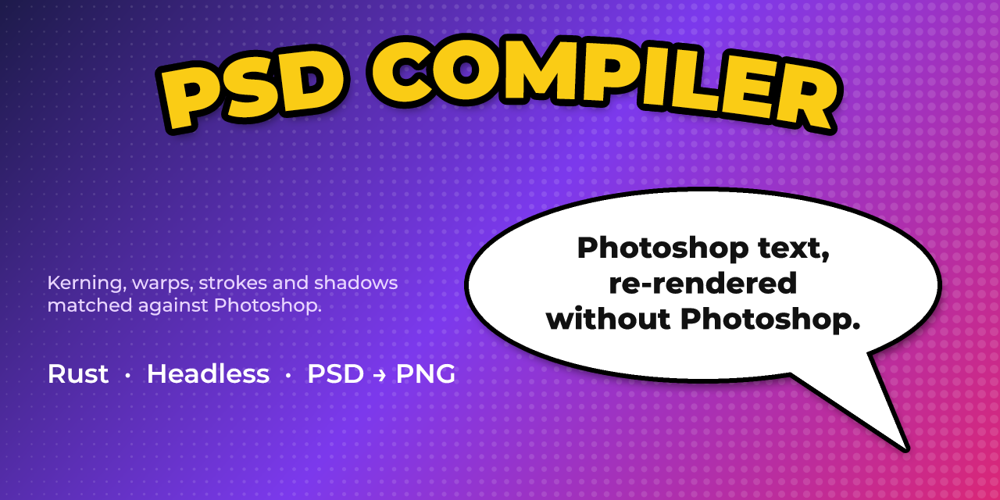
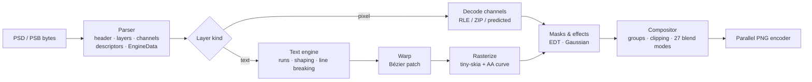

<div align="center">



# PSD Compiler

**Turn Photoshop files into pixel-perfect PNGs on any machine, with no Photoshop, no browser and no GPU.**

`psdc` parses PSD/PSB files and composites every layer. It also **re-renders text layers from the type data**, so text you edit (in the file, with `--set-text`, or through the library) shows up in the output, and it can save the edited document back as a PSD.

[](https://github.com/ChoqueCastroLD/psd-compiler-cli/actions/workflows/ci.yml)
[](LICENSE)
[](https://www.rust-lang.org)


[Quick start](#quick-start) ·
[CLI](docs/CLI.md) ·
[Library](#use-it-as-a-library) ·
[How it works](docs/ARCHITECTURE.md) ·
[Text engine](docs/TEXT_ENGINE.md) ·
[FAQ](#faq)

</div>

---

## Why

Most tools that "render" a PSD actually show you the **merged preview** Photoshop saved in the file, or the **cached pixels** of each layer. Once you change a text layer (translate a comic, fill a template, localize a banner), those pixels are stale. Your only option left is to open Photoshop.

PSD Compiler reads the type engine data (characters, style runs, paragraphs, warps and effects) and lays the text out again with the real fonts. It was calibrated against Photoshop until the output matched.

```text
                   ┌──────────────┐
  page.psd  ─────▶ │     psdc     │ ─────▶  page.png
  (edited text)    │  parse       │         (text re-rendered,
                   │  shape       │          effects applied,
  fonts/    ─────▶ │  rasterize   │          layers composited)
                   │  composite   │
                   └──────────────┘
```

## Highlights

- 🎯 **Photoshop-grade text.** Kerning, tracking, leading, paragraph boxes, justification, faux bold and italic, all caps and small caps, baseline shift, underline and strikethrough. Text layers on real comic pages reach **IoU ≈ 0.97** against Photoshop's own rasters.
- 🈳 **Vertical text and OpenType.** Upright CJK, rotated Latin and the `vert` feature, plus ligatures, contextual alternates, swashes, fractions, ordinals, oldstyle figures and super/subscript from the character styles.
- 🌀 **Every warp.** All 15 presets (Arc, Arch, Bulge, Flag, Wave, Fish, Rise, Fisheye, Inflate, Squeeze, Twist, Shell…), built from the same Bézier patches Photoshop uses, plus custom and quilt warp meshes.
- ✨ **All layer effects.** Stroke (solid, gradient or pattern; inside, center or outside), drop and inner shadow, outer and inner glow, satin, bevel and emboss, and color, gradient and pattern overlays, using Photoshop's blur and spread model.
- 🎛️ **Adjustment layers.** Levels, curves, brightness/contrast, hue/saturation, color balance, vibrance, exposure, selective color, channel mixer, gradient map, photo filter, invert, posterize, threshold and black & white.
- 🧩 **Smart objects.** Cached pixels by default; with `--render-smart-objects` (or after editing text inside one) they are re-rendered from the embedded PSD/PSB, PNG or JPEG through the placement's perspective and warp.
- 🧱 **Full compositing.** All 27 blend modes, groups with pass-through and knockout, clipping masks, layer and vector masks, fill layers (solid, gradient, pattern), opacity and fill opacity.
- 📦 **The whole format.** PSD and PSB, 1/8/16/32-bit, RGB, grayscale, bitmap, CMYK, indexed, Lab, duotone and multichannel, and raw, RLE, ZIP and ZIP-with-prediction channels.
- 💾 **Edit and save.** Replace text from the CLI or the API, then write PNG, JPEG, WebP, TIFF, AVIF, or the edited PSD/PSB itself.
- ⚡ **Fast.** About 140 ms for a 1284×1826 comic page, from parsing through to the PNG. Batches run in parallel and PNGs are compressed in parallel strips.
- 🔤 **Bring your own fonts.** Fonts are found by PostScript name in your folders and in the system font directories. No fonts ship with the project.
- 🦀 **One static binary**, plus a small, safe Rust library.

## Quick start

```sh
cargo install --git https://github.com/ChoqueCastroLD/psd-compiler-cli
```

```sh
psdc page.psd                       # → page.png
psdc page.psd -f ./fonts            # look in ./fonts first
psdc chapter/*.psd -o rendered/     # batch, in parallel
```

Try it on the demo file in this repo. It needs [Montserrat](https://fonts.google.com/specimen/Montserrat) installed or in a `fonts/` folder:

```sh
psdc docs/assets/demo.psd -o demo.png
```

<details>
<summary><b>Build from source</b></summary>

```sh
git clone https://github.com/ChoqueCastroLD/psd-compiler-cli
cd psd-compiler-cli
cargo build --release
./target/release/psdc --help
```

</details>

## Fonts

PSD files store font **names**, not font files. `psdc` matches the PostScript name stored in each style run, such as `Montserrat-Black`, against font files it finds in this order:

| Priority | Source | Notes |
|---|---|---|
| 1 | `--fonts DIR` | Repeatable. Searched recursively. |
| 2 | `PSDC_FONTS` | A path list (`:` separated, `;` on Windows). |
| 3 | `./fonts` | Used if it exists in the working directory. |
| 4 | System fonts | User and system font folders on Linux, macOS and Windows. Disable with `--no-system-fonts`. |

TTF, OTF, TTC and OTC files are supported. Name matching ignores case, spaces and punctuation, so `Montserrat Black` also finds `Montserrat-Black`. The font index is cached in `~/.cache/psd-compiler/fonts.tsv`, so startup takes milliseconds even with thousands of fonts installed.

If a font is missing, `psdc` picks the closest weight and slant of the same family, or else of a common sans, serif or monospace family, adds synthetic bold or italic when the substitute lacks them, and prints a warning naming the face it used. Characters the face lacks fall back to a face that has them. Map fonts yourself with `--font-map CCWildWords-Roman=Anton-Regular`, or use `--keep-text` to output Photoshop's cached text pixels instead.

## CLI

```text
psdc [OPTIONS] <INPUT>...

  -o, --output <PATH>          Output file (one input) or directory (several inputs)
  -F, --format <FORMAT>        png, jpg, webp, tif, avif, or psd [default: from -o, else png]
  -Q, --quality <1-100>        JPEG and AVIF quality [default: 90]
      --background <RRGGBB>    Color transparency is flattened onto for JPEG [default: ffffff]
      --set-text <LAYER=TEXT>  Replace a type layer's text; `Smart object/Layer` reaches inside
      --list-text              List the type layers instead of compiling
  -f, --fonts <DIR>            Font folder to search first; repeatable
      --font-map <FROM=TO>     Draw font FROM with font TO; repeatable
      --no-system-fonts        Only use --fonts, PSDC_FONTS and ./fonts
      --keep-text              Keep Photoshop's cached text pixels
      --render-smart-objects   Re-render smart objects from their embedded files
      --text-masks <DIR>       Write each type layer's coverage as a grayscale PNG
  -c, --compression <0-9>      PNG and TIFF compression level [default: 2]
  -j, --jobs <N>               Worker threads [default: all cores]
      --timings                Print parse / render / write times
  -q, --quiet                  Only print errors
```

Translate a page and keep it editable:

```sh
psdc es.psd --set-text 'Title=Hello\nworld' --set-text 'Card/Name=Ana' -o en.psd
```

The full reference is in [docs/CLI.md](docs/CLI.md).

## Use it as a library

```toml
[dependencies]
psd-compiler = { git = "https://github.com/ChoqueCastroLD/psd-compiler-cli" }
```

```rust
use psd_compiler::{render, Document, FontDb, RenderOptions, DEFAULT_COMPRESSION};

fn main() -> Result<(), Box<dyn std::error::Error>> {
    let mut fonts = FontDb::new();
    fonts.add_dir("fonts");
    fonts.add_system_fonts();

    let original = std::fs::read("page.psd")?;
    let mut doc = Document::parse(&original)?;
    for layer in &doc.layers {
        if let Some(text) = layer.text() {
            println!("{}: {text:?}", layer.name);
        }
    }
    doc.set_text("Title", "Hello\nworld")?;

    let out = render(&doc, &fonts, &RenderOptions::default());
    out.warnings.iter().for_each(|w| eprintln!("warning: {w}"));
    out.image.save_png("page.png", DEFAULT_COMPRESSION)?;

    let (psd, _warnings) = doc.to_psd(&original, &fonts, &RenderOptions::default())?;
    std::fs::write("page.edited.psd", psd)?;
    Ok(())
}
```

The API surface:

| Item | Purpose |
|---|---|
| `Document::open` / `Document::parse` | Parse a PSD/PSB from a path or bytes. |
| `Document::layers` | A flat, bottom-to-top list of `Layer`s: name, bounds, blend mode, opacity, kind, and `text()`. |
| `Document::set_text` | Replace the text of type layers by name, including `Smart object/Layer` paths. |
| `Document::to_psd` | Write the edited document back as PSD/PSB; untouched data is copied byte for byte. |
| `FontDb` | Font discovery: `add_dir`, `add_file`, `add_system_fonts`, `alias` and an on-disk index cache. |
| `render(&doc, &fonts, &options)` | Composites the document into an `Image` (RGBA8), plus `warnings` and optional `text_masks`. |
| `Image::encode` / `save` | PNG, JPEG, WebP, TIFF or AVIF, chosen by `Format` or the file extension. |
| `Image::encode_png` / `save_png` | Fast parallel PNG encoder. It writes RGB when the image is opaque. |
| `psd_compiler::png::encode` | The same encoder for any gray, RGB or RGBA buffer. |

Run `cargo doc --open` for the full API documentation.

## How it works



Each stage is covered in [docs/ARCHITECTURE.md](docs/ARCHITECTURE.md). The calibration behind the text output (kerning rules, anti-aliasing curves, shadow falloff, warp tables) is in [docs/TEXT_ENGINE.md](docs/TEXT_ENGINE.md).

## Fidelity

Measured against Photoshop on production comic pages:

| What | Metric | Result |
|---|---|---|
| Text layers (body, bold, stroked) | IoU of glyph coverage vs Photoshop raster | **≈ 0.97** |
| Warp presets (all 15) | IoU vs reference renders | **0.94 – 0.98** |
| The 712 test files of [psd-tools](https://github.com/psd-tools/psd-tools), [ag-psd](https://github.com/Agamnentzar/ag-psd), [webtoon/psd](https://github.com/webtoon/psd), [psd.rb](https://github.com/layervault/psd.rb), [chinedufn/psd](https://github.com/chinedufn/psd), [PhotoshopAPI](https://github.com/EmilDohne/PhotoshopAPI), [psd_sdk](https://github.com/MolecularMatters/psd_sdk), [psd.js](https://github.com/meltingice/psd.js), [Krita](https://invent.kde.org/graphics/krita) and [Aspose.PSD](https://github.com/aspose-psd/Aspose.PSD-for-.NET) | Match the composite Photoshop stored (mean difference ≤ 2/255, ≤ 1% of pixels off by more than 16) | **690 / 712 (96.9%)** |

The reference test renders every file from its layers and compares it with the merged image Photoshop saved, then prints the match rate of every feature (color modes, depths, layer kinds, blend modes, masks, each effect and adjustment). CI runs it on every push; locally:

```sh
git clone https://github.com/psd-tools/psd-tools
git clone https://github.com/Agamnentzar/ag-psd
PSDC_REFERENCE_DIR=psd-tools/tests/psd_files:ag-psd cargo test --release --test reference -- --nocapture
```

Some misses are out of reach by design: Dissolve and noise gradients use Photoshop's random generator. [docs/REFERENCE.md](docs/REFERENCE.md) lists every miss and the models calibrated against the suite.

## Performance

On a 1284×1826 comic page with about 20 text layers, effects included:

| Stage | Time |
|---|---|
| Parse | ~20 ms |
| Render (text, effects, composite) | ~80 ms |
| PNG encode (level 2) | ~30 ms |
| **Total** | **~140 ms** |

Here is why it is fast:
- Layers render in parallel.
- Distance transforms run on a supersampled grid, only around the layers that need them.
- Compositing is row-parallel.
- The PNG encoder compresses 64-row strips on every core and stitches them into one valid zlib stream, the way pigz does.

## Feature matrix

| Area | Supported | Not yet |
|---|---|---|
| Files | PSD, PSB, 1/8/16/32-bit; writes edited PSD/PSB in RGB, grayscale, CMYK, Lab, duotone and indexed (32-bit RGB and grayscale too) | Writing bitmap or multichannel documents |
| Color | RGB, grayscale, bitmap, CMYK, indexed, Lab, duotone (Photoshop's ink preview, else the ink curves), multichannel | Duotone with color-book inks and no preview (shown as grayscale) |
| Layers | Pixel, text, groups, pass-through, knockout, clipping, layer and vector masks, fill layers, shape strokes, opacity, fill, Blend If, channel restrictions, blend interior/clipped layers as group | |
| Adjustments | Levels, curves, brightness/contrast, hue/saturation, color balance, vibrance, exposure, selective color, channel mixer, gradient map, photo filter, invert, posterize, threshold, black & white, color lookup (CUBE, 3DL, LOOK, abstract and device-link profiles) | |
| Smart objects | Cached pixels; re-rendered from embedded or linked PSD/PSB, PNG or JPEG with perspective and warps; text edits inside; smart filters: Gaussian, box and motion blur, blur, blur more, sharpen, sharpen more, sharpen edges, unsharp mask, high pass, median, maximum, minimum, offset, custom, mosaic, invert, solarize, average, curves, brightness/contrast | Other smart filters (cached pixels used), smart filter masks |
| Blend modes | All 27, including Dissolve, Hue/Saturation/Color/Luminosity | |
| Text | Point and paragraph text, runs, kerning, tracking, leading, scale, baseline shift, caps, faux styles, decorations, all justification modes, indents, spacing, vertical text, OpenType features, any size | |
| Warps | All 15 presets, bend, horizontal/vertical distortion, custom and quilt meshes | |
| Effects | Stroke (solid, gradient, pattern), drop and inner shadow, outer and inner glow, satin, bevel and emboss, color/gradient/pattern overlay | |
| Fonts | PostScript name lookup, closest-style substitution, synthetic bold/italic, `--font-map` | |
| Output | PNG, JPEG, WebP, TIFF, AVIF, PSD/PSB | |

Anything unsupported produces a **warning**, never a crash. Text that can't be parsed falls back to the cached pixels.

## Text masks

`--text-masks DIR` writes one grayscale PNG per type layer, showing exactly where its glyphs land on the canvas. This is useful for translation pipelines: you can inpaint under the original text, check that a translation fits its bubble, or diff two versions of a page.

```sh
psdc page.psd --text-masks masks/   # masks/page.text000.png, page.text001.png, …
```

## FAQ

**Does it need Photoshop, Photopea, a browser or a GPU?**
No. It is a single native binary running on the CPU.

**Can I edit the PSD and re-render?**
Yes, that is the main use case. Change the text in Photoshop or with any tool that writes PSD type layers, then run `psdc`. Text is laid out again from the type data every time.

**Why does my text look different from Photoshop?**
Almost always the font is missing or is a different version. Look for `font X not found` warnings and pass the right folder with `-f`.

**Is it safe on untrusted files?**
The parser is written in safe Rust. It bounds-checks every read, limits nesting depth and caps allocation sizes. A malformed file returns an error.

**Does it write PSDs?**
Yes. With an output ending in `.psd`/`.psb` (or `-F psd`), `psdc` saves the document with your `--set-text` edits: edited type layers and smart objects get new pixels and type data, the merged preview is re-rendered, and everything else is copied unchanged. It never overwrites the input.

## Roadmap

- [x] Smart filters (common blur, sharpen, other and color filters)
- [x] Color lookup adjustments
- [x] Writing CMYK, Lab, duotone, indexed and 32-bit PSDs
- [ ] More smart filters (noise, distort, Camera Raw) and smart filter masks
- [ ] WebAssembly build

## Contributing

Contributions are welcome. [CONTRIBUTING.md](CONTRIBUTING.md) covers the dev loop, the test builder that generates PSDs in code, and the rules for adding calibrated behavior.

## Acknowledgements

Format details were cross-checked against [psd-tools](https://github.com/psd-tools/psd-tools) (MIT) and its test files.

## License

[MIT](LICENSE) © Luis David Choque Castro
