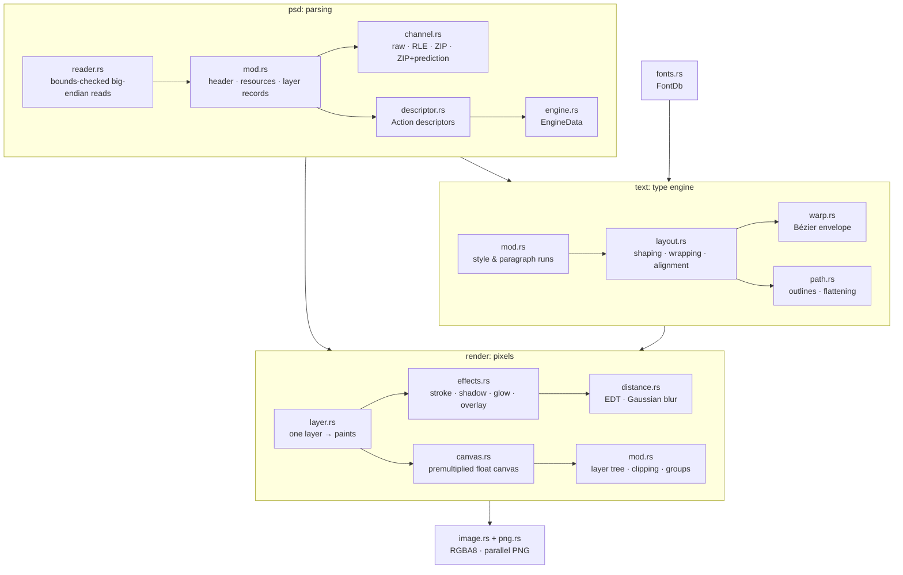

# Architecture

PSD Compiler is a pipeline of small, independent stages. Each stage owns one concern and has its own unit tests.

## Module map

| Module | Responsibility |
|---|---|
| `error` | `Error` (I/O or format) and `Result`. The library never panics on malformed input. |
| `psd::reader` | Cursor over a byte slice. Every read is bounds-checked, and PSB widens lengths to 64 bits. |
| `psd` | `Document`, `Layer`, `Rect`. Parses the header, image resources (global light angle), layer records, tagged blocks, channel data and the merged composite. |
| `psd::channel` | Channel decompression (PackBits, zlib, zlib with delta prediction for 8/16/32-bit) and conversion to 8-bit. |
| `psd::descriptor` | Photoshop Action descriptors (`TEXT`, `doub`, `UntF`, `enum`, `Objc`, `VlLs`, `tdta`, …), used by type layers, warps and effects. |
| `psd::engine` | The PostScript-like EngineData syntax of type layers (`<< /Key value >>`, arrays, UTF-16 strings). Nesting depth is capped. |
| `text` | Resolves the style sheet chain (normal sheet → paragraph sheet → run) into one `Style` and `Paragraph` per character. |
| `text::layout` | Shapes with rustybuzz, wraps lines, applies leading, justification, indents, caps, faux styles and decorations, then warps. |
| `text::warp` | Builds the 4×4 Bézier patch for each warp preset and applies horizontal/vertical distortion. |
| `text::path` | Path segments, transforms, bounds and adaptive flattening (used before warping). |
| `fonts` | Font discovery and lookup by PostScript name, full name or family prefix. Fonts load lazily, and the scan results are cached on disk. |
| `render::layer` | Turns one layer into `Paint`s: decoded pixels or rasterized text, then mask, then effects. |
| `render::effects` | Parses `lfx2`/`lmfx` and produces the effect rasters. |
| `render::distance` | Exact Euclidean distance transforms on a 4× supersampled grid, and a separable truncated Gaussian. |
| `render::canvas` | Premultiplied `f32` RGBA canvas, `source-over` and blend-mode compositing, row-parallel for large areas. |
| `render` | Builds the group tree, renders leaves in parallel, and composites bottom to top with clipping and pass-through. |
| `blend` | The 27 Photoshop blend modes, separable and non-separable. |
| `image` | Converts to straight-alpha RGBA8 and encodes PNG. |
| `png` | Parallel PNG encoder (see below). |

## Data flow for one page

1. **Parse.** `Document::parse` reads the whole file once. Layer records keep only the tagged blocks the renderer uses (`TySh`, `lfx2`, `lmfx`, `lsct`, `lsdk`, `iOpa`, `luni`). Channel data is decoded into 8-bit planes up front.
2. **Tree.** `render::build_tree` turns the flat, bottom-to-top record list into nested groups, using the `lsct` section dividers.
3. **Leaves.** Every visible leaf renders independently and in parallel (`rayon`):
   - pixel layers use their decoded channels;
   - text layers are parsed into a `TextLayer`, laid out, warped and rasterized with tiny-skia;
   - the layer mask is applied;
   - effects that need distances (stroke, glow, spread shadows) share one distance-field computation.
4. **Composite.** Leaves and groups are drawn bottom to top onto a premultiplied float canvas.
   - Clipped layers composite into their base's alpha.
   - Pass-through groups draw straight into the parent.
   - Other groups render to their own canvas first.
5. **Encode.** The canvas becomes straight-alpha RGBA8. The PNG is written as RGB when every pixel is opaque.

If a document has no layers, the merged composite stored in the file is used.

## Parallel PNG encoding

PNG wants a single zlib stream, which normally means a single thread. `png::encode` does this instead:

1. Split rows into 64-row strips. Each strip is filtered with the minimum-sum-of-absolute-differences heuristic, which needs only the previous row.
2. Deflate every strip independently. Each one ends with a *sync flush*, which byte-aligns the output so the pieces can be concatenated.
3. Combine the strips' Adler-32 checksums with `adler32_combine` instead of re-hashing.

This is the technique `pigz` uses. On a 1284×1826 page the encoder is several times faster than single-threaded flate2 at the same level.

## Memory and safety

- No `unsafe` outside one documented page-prefault helper. `unsafe_op_in_unsafe_fn` is denied.
- Readers return `Error::Format` instead of panicking on truncated or hostile input. Allocation sizes come from validated lengths, and pre-allocations are capped.
- Text rasters are capped at 40 megapixels. EngineData nesting is capped at 256.
- Fonts load lazily (`OnceLock`), so only the faces a document uses are ever read.

## Performance notes

- `mimalloc` is the global allocator of the binary only. The library leaves allocator choice to you.
- Row-parallel loops only kick in above `PARALLEL_MIN` (256 Ki pixels), so small layers avoid scheduling overhead.
- Distance transforms are computed once per layer, and only within the largest radius any effect queries.
